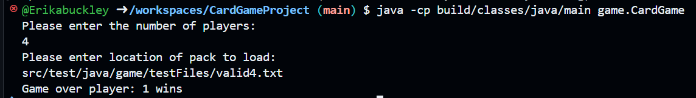

# Card Game project for ECM2414 Software Development Continuous Assessment (CA)

This Card Game project was created as a submission for the ECM2414 Software Development Continuous Assessment. It was developed using pair programming techniques that were taught in this module.


## Table of Contents
- [About](#about)
- [Features](#features)
- [Getting Started](#getting-started)
  - [Prerequisites](#prerequisites)
  - [Running the Tests](#running-the-test-suite)
  - [Running the Project](#running-the-project)
- [License](#license)

---

## About
The game simulates a card game similar to 'Pig' or 'Spoons' where players attempt to obtain a hand of identical cards by drawing and discard from a deck.  In this project, hands and decks are drawn from a pack which contains 8n cards, where n is the number of players (and a positive integer).  

---

## Features
- ### Card game mechanics
  Deals cards to players, plays game and outputs resuplts to files.


- ### Multi-threading
  As the specification requires we used threading to perform actions in parralel.
  -  Draw and discard to count as one atomic action
  -  Multi-threading has been implemented to carry out main game loop
  - Thread-safe  classes
  - Syncronized methods

- ### JUnit 4 test suite
  Implements JUnit 4 testing to ensure that code works as expected and meets the assement criterea.


---

## Getting Started

### Prerequisites

Make sure you have the following installed:
- [Java JDK 17+](https://www.oracle.com/java/technologies/javase-downloads.html)
- A code editor or IDE like [IntelliJ IDEA](https://www.jetbrains.com/idea/) or [Eclipse](https://www.eclipse.org/)


## Running the Tests

The tests for this project are written with JUnit 4 and Gradle

### Installations
JUnit4, Java 17 and Gradle

### Getting Started

Navigate to home directory

```bash
cd CardGameProject
```
      
### Run the tests

Run the following to build and run the test files

```bash
./gradlew clean build test
```

### Test results

If all the tests pass, the following should come up in the terminal

```bash
    BUILD SUCCESSFUL
    9 actionable tasks: 9 executed
```

Any errors will be displayed
    
## Running the Project

Run project using the command

```bash
java -cp build/classes/java/main game.CardGame
```

Type player number and file name matching to player number, including full path:

eg 4 and src/test/java/game/testFiles/valid4.txt

If valid pack then winner will be displayed on screen. Press ctrl + c to quit.
If not valid pack game will loop forever.

## Example run

For 4 players this would be the output



## License
MIT license - see file
